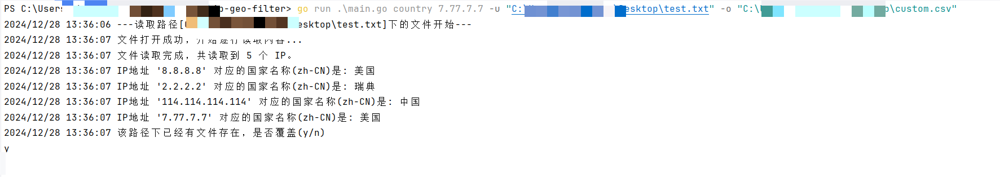

# ip-geo-filter

一个用于IP地理位置查询的命令行工具。


## 简介

`ip-geo-filter` (igf) 是一个命令行工具，用于根据IP地址查询其对应的地理位置信息，包括国家、地区、城市等。它使用 GeoLite2 数据库进行IP地址的解析。

效果图


## Feture


    1.根据文件中的ip地址输出对应的iso文件
    2.根据IP段输出指定国家的ip
    3.排除指定国家的IP段
    ...


## 特性

*   支持单个或多个IP地址查询。
*   支持指定输出语言（例如：中文、英文、日文等）。
*   提供详细的错误信息提示。
*   使用 GeoLite2 数据库，数据准确可靠。
*   跨平台支持（理论上支持所有 Go 语言支持的平台）。
*   支持读取指定文件中ip进行处理
*   支持将country结果集批量写入到指定目录或者文件下的csv中

## 提醒

*  指定输出文件地址时支持目录和文件，目录请尽量不要包含中文，可能会有不确定的错误发生，输出文件目前只支持`.csv`文件，请不要指定其他文件类型目前没有做对应的控制

## 使用

### windows系统
```powershell
.\igf.exe [Commend] [Args]
```

